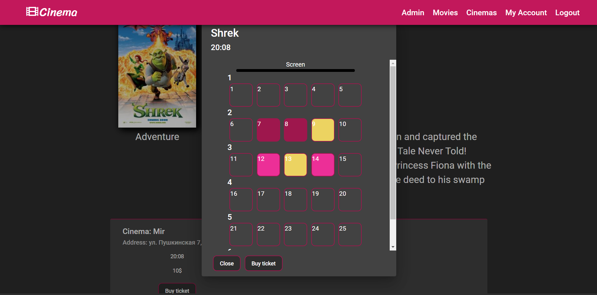

# Cinema
## Table of Contents
- [Description](#description)
- [Structure](#structure)
- [Usage](#usage)
- [What is included](#what-is-included)
- [Start](#start)
- [Some Screenshots](#some-screenshots)
## Description
This app imitate buying of tickets on movies in cinemas.
User can: create an account, brows pages of movies or cinemas, buy tickets on seances, top up the account also there is list of all cinemas and movies.
There is filtering movies by genre and pagination of pages. 
Admin can: add new films, add new cinemas, add seances also there is possibility of sending emails for all users or for one. 

## Structure
This app is build on microservice architecture: backend, api and frontend.
Frontend and api are binded with proxy server which redirects all requests started with "/api/*" wildcard to api server.
Backend realize connection with database MySql for manage data.
Api responsible for data transfer and handling data also api realize security of app.
Fronted is working as client side displayed in the browser.
Backend and api are java apps created with spring framework.
Frontend - Angular application.
Connection between services realize with http requests.
Users authentication is provided via JWT. 
There is interceptor, which add jwt to header, in frontend.

## Usage
* Angular
* Angular Material
* Spring Boot
* Spring Data
* Spring Security
* Maven
* JWT 
* MySql
* RxJS

## What is included
* Interceptor,
* Proxy server
* Pagination
* Security
* JWT
* Mail sendler
* APP_INITIALIZER token
* Custom Angular Pipe
* Promises and Observables
* End-to-end conection

## Start
### For start Frontend
```bash
npm install
```
after
```bash
ng serve
```
or
```
npm run start
```
### For Backend and Api
```
mvn clear install
```
## Some Screenshots
> For more see 'img' folder
### Ticket Purchase Page

### Home Page

### All Movies Page

